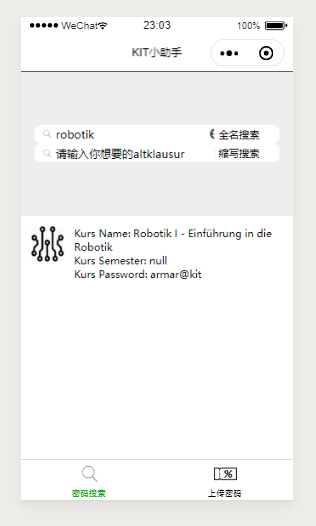
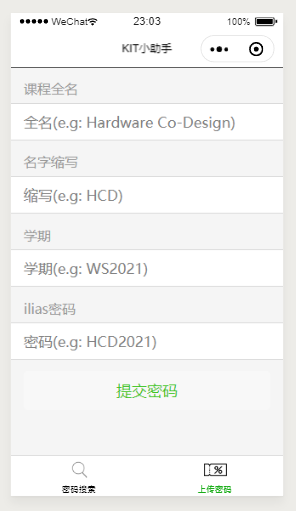

# KIT-Helper

# 介绍

这是一个ilias课程密码的分享平台，主要是有很多同学会有遗忘密码，或者想要看以往课程，但不知道密码的问题。所以提供一个这样的平台，来为大家提供便利。

# 使用方法

## 查看密码

- 目前实现了2种方式：全名查找 和 缩写查找

全名查找其实只要打一部分关键词，就可以被检索到，比如hardware就可以检索到hardware software co-design 这样的全名

缩写查找是指课程名称的缩写：比如：hsc

## 上传密码

- 请同学们认真填写密码，我没有设置填写检查（一方面是懒，另一方面是相信同学们）

## PS

- 这里用到了xiaoyao同学整理的我们所etit的课程密码，非常感谢见[这里](csv/pwdtest.csv)
- 由于其中没有缩写，这部分数据的缩写搜索暂不支持

# 上线版本
还在过审核

# 背景

- 其实是一个很简单的crud的项目，由于没有相关背景知识，也比较好奇就学习了一下

# 技术栈

- backend: spring boot 
- backend-compiler: maven 
- backend-language: java
- backend-database: mariadb/mysql
- backend-server: tencent-cloud/centos
- front-end: wx-miniprogramm
- front-language: js+wxss+wxml
- test-software: postman
- https: supported

# 前端的优化

对于这个小项目有兴趣的同学，可以一起来优化或者改进一下前端的界面。
目前的改进点有：
1. 结果更灵活的显示
2. 删除按钮更灵活的显示
3. 输入检测，防止乱输污染数据库
4. 增加新功能（食堂菜单误

 
